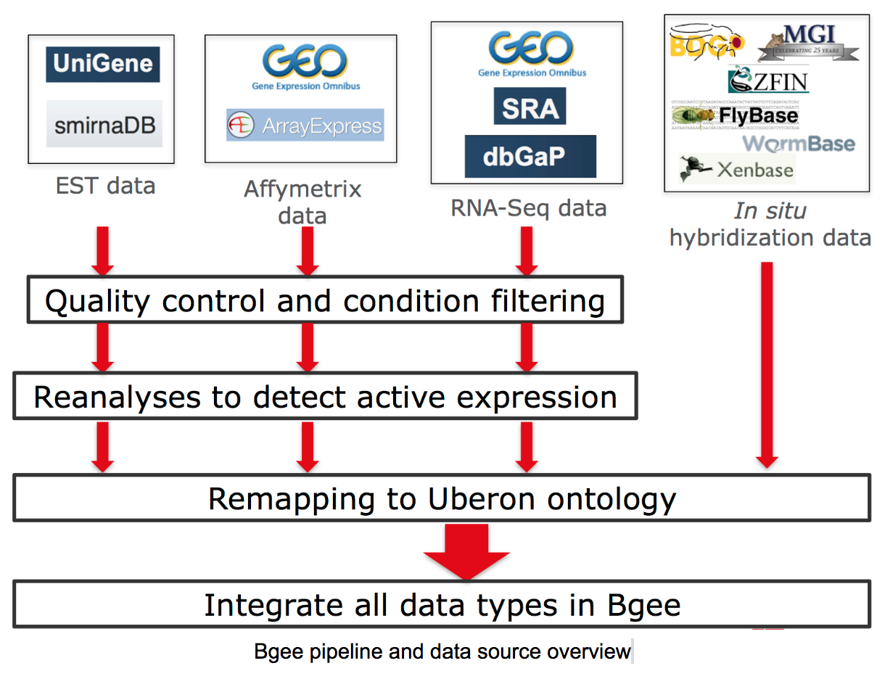

# Pipeline of Bgee release 15.2

[](https://doi.org/10.1093/nar/gkae1118)
[](https://doi.org/10.1093/nar/gkaa793)
[](https://bsky.app/profile/bgee.org)
[](https://genomic.social/%40bgeedb)

# Bgee pipeline documentation: content

**General information**

1. [Introduction](#introduction)
2. [Directory structure](#directory-structure)
3. [Pipeline steps](#pipeline-steps)

**Developer guidelines**

1. [Documenting the pipeline](#documenting-the-pipeline)
2. [Writing Makefiles](#writing-makefiles)
3. [Versioning input/output files](#versioning-inputoutput-files)
3. [To do at each release of the pipeline](#to-do-at-each-release-of-the-pipeline)

# General information

## Introduction

Bgee is a database to retrieve and compare gene expression patterns in multiple animal species, 
produced from multiple data types (RNA-Seq, Affymetrix, _in situ_ hybridization, and EST data).

Bgee is based exclusively on curated "normal", healthy, expression data (e.g., no gene knock-out, 
no treatment, no disease), to provide a comparable reference of normal gene expression.

Bgee produces ranked calls of presence/absence of expression, and of differential over-/under-expression, 
integrated along with information of gene orthology, and of homology between organs. 
This allows comparisons of expression patterns between species.



## Directory structure:

* [pipeline/](pipeline/): contains the Makefiles and scripts used to generate data.
The Bgee pipeline is a mixture of Perl scripts, R scripts, Java code.
They are all called through the use of makefiles.
This directory is organized by sub-directories, corresponding to steps in the pipeline,
that each contains a Makefile to be run. Common parameters are defined
in the files [pipeline/Makefile.common](pipeline/Makefile.common) (for non-sensitive variables)
and [pipeline/Makefile.Config](pipeline/Makefile.Config) (for sensitive variables, e.g., passwords).

* [source_files/](source_files/): contains the source data used for the pipeline, for instance, files from annotators
in TSV format, downloaded ontologies to use, downloaded files from MOD, etc.

* [generated_files/](generated_files/): contains the files and outputs generated by the pipeline.

* [java/](java/): contains files related to the Bgee Java project. Some Makefiles use them through 
command line arguments.

## Pipeline steps

Each step of the pipeline is represented by a sub-directory in the [pipeline/](pipeline/) directory. 
See [pipeline/README.md](pipeline/README.md) for description of the steps, and configuration.

# Developer guidelines

1. [Documenting the pipeline](#documenting-the-pipeline)
2. [Writing Makefiles](#writing-makefiles)
3. [Versioning input/output files](#versioning-inputoutput-files)

## Documenting the pipeline

The pipeline is documented directly in the relevant directories of the pipeline,
through `README.md` files. See [pipeline/](pipeline/) directory as a starting point.

Recommended sections:

* Aim of the step, and previous steps required.
* `Details`: explanations about the step
* `Data generation`: how to run the step
* `Data verification`: how to verify that the step was correctly run
* `Error handling`: what to do when confronted to typical errors
* `Other notable Makefile targets`: individual Makefile targets that could be useful

## Writing Makefiles

### Mandatory variables and import

Two variables that are used in [pipeline/Makefile.common](pipeline/Makefile.common) must be defined by each Makefile:

* `PIPELINEROOT`: defines the path to the root folder of the pipeline, relative to the Makefile
(i.e., to target the directory [pipeline/](pipeline/)).
* `DIR_NAME`: defines the name of the directory where lives the Makefile (e.g., `species/`).
This allows to use folders of same name in [source_files/](source_files/) and [generated_files/](generated_files/).

These variables must be defined before importing [pipeline/Makefile.common](pipeline/Makefile.common). They allow
to define useful common variables from [pipeline/Makefile.common](pipeline/Makefile.common), e.g.: `VERIFICATIONFILE`,
`INPUT_DIR`, `OUTPUT_DIR`.

Example start of a Bgee Makefile in [pipeline/species/](pipeline/species/):

    PIPELINEROOT := ../
    DIR_NAME := species/
    include $(PIPELINEROOT)Makefile.common

### Step verification file

The `all` target of the Makefile must always be to generate a step verification file,
whose path is accessible through the variable `$(VERIFICATIONFILE)`. The `all` target
should either be the first target defined in the Makefile, or be assigned as the default goal
(i.e., `.DEFAULT_GOAL := all`).

This verification file must contain information allowing to easily assess
whether all the targets of the Makefile were successfully run. For instance,
to generate this file, a Makefile could launch a query to the database to verify
correct insertion of data.

Example Makefile targets:
   ```
    all: $(VERIFICATIONFILE)
    
    ...
    
    $(VERIFICATIONFILE): dependency1 dependency2 ...
        @$(MYSQL) -e "SELECT * FROM taxon where bgeeSpeciesLCA = TRUE order by taxonLeftBound" > $@.temp
        @$(MV) $@.temp $@
   ```
### Input/output folders

In order to more efficiently save input files and files generated by a pipeline run,
they are kept in specific folders, not mixed with pipeline scripts, in [source_files/](source_files/) and
[generated_files/](generated_files/). The directory structure in these folders should be the same as
in the [pipeline/](pipeline/) directory.

No Makefile should read directly from or write directly into the [pipeline/](pipeline/) folder.

### Common variables

When a file name, or URL, etc, is used in several Makefiles, it should be assigned to
a variable in [pipeline/Makefile.common](pipeline/Makefile.common). Notable variables:

* `SOURCE_FILES_DIR`: corresponds to `$(PIPELINEROOT)../source_files/`
* `INPUT_DIR`: corresponds to `$(SOURCE_FILES_DIR)$(DIR_NAME)`
* `GENERATED_FILES_DIR`: corresponds to `$(PIPELINEROOT)../generated_files/`
* `OUTPUT_DIR`: corresponds to `$(GENERATED_FILES_DIR)$(DIR_NAME)`
* `VERIFICATIONFILE`: corresponds to `$(OUTPUT_DIR)step_verification_$(RELEASE).txt`
* `TMPDIR`
* useful commands:
  * `$(JAVA)`
  * `$(MYSQL)`
  * `$(MYSQLNODBNAME)`
  * `$(CURL)`: and see `$(APPEND_CURL_COMMAND)`; allows to download a file only if the remote
  file is newer than the local file, and to a save it to a tmp file until the transfer
  is successfully completed.

### Secured variables

If a variable contains sensitive information (e.g., a password), it should be defined in
[pipeline/Makefile.Config](pipeline/Makefile.Config). The actual values of these variables should not be versioned! (simpler
than to encrypt the file)

## Versioning input/output files

Source and generated files should be versioned using git, if not too large.
This versioning is not performed automatically by the Makefiles. It is the responsibility
of the person in charge to version the relevant files when a step is completed.

## To do at each release of the pipeline

Branch `master` always reflects the pipeline for the current release of Bgee,
`develop` is the pipeline in development for the next version of Bgee. When you do a new release:

* Before the merge, in `develop` branch, check and update the information in `pipeline/db_creation/update_data_sources.sql` about the release about to be made. Notably, check the information about the Bgee release, the date of freeze of import of the data, etc.
  * Update the database to be released using this file BEFORE generating the full dump for archiving
* Before the merge, in `develop` branch, check the file `TODO.md`, remove/strikeout what has been done and is not to do anymore.
* merge `develop` into `master`
* In `develop`, update the version number in the top title of this README.md file to be the next release of Bgee.
* In `develop`, update `pipeline/Makefile.common` to reflect the new login info to connect to databases etc.
