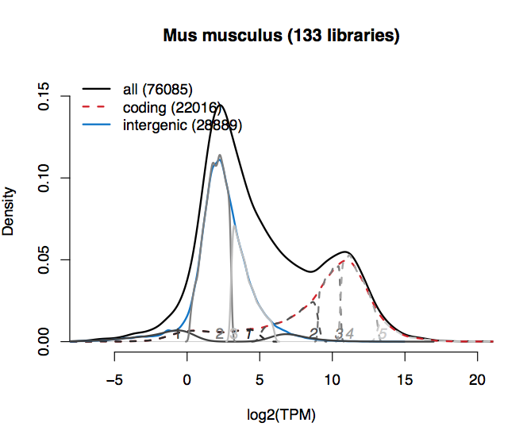
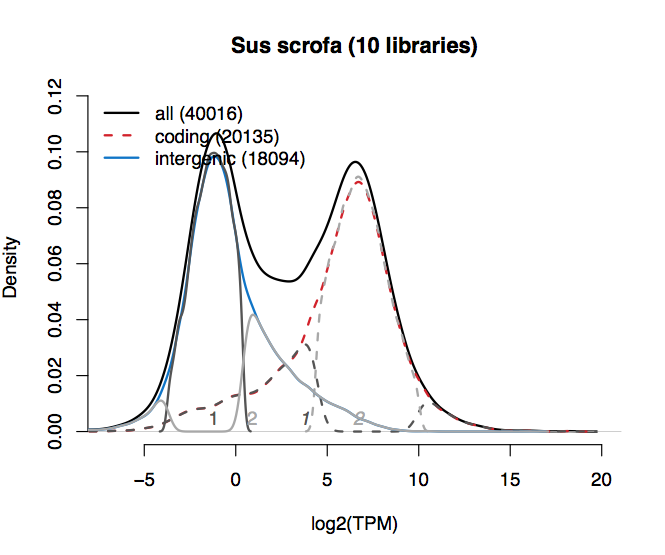
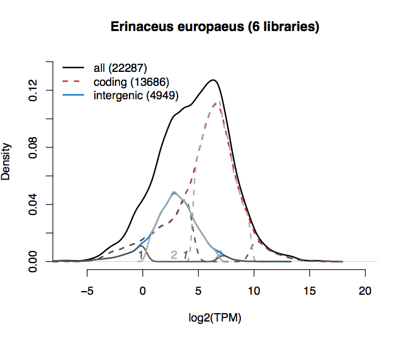
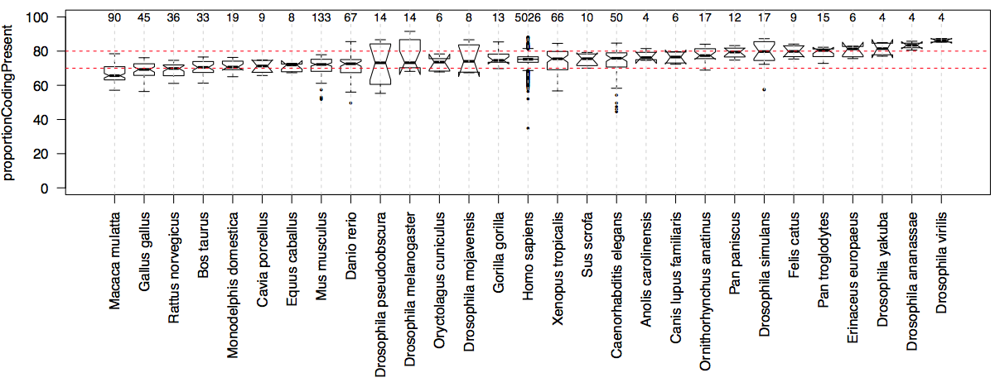

# Bgee RNA-Seq analysis pipeline

**General information:**

1. [Introduction](#introduction)
2. [Step 1: Data annotation](#step-1-data-annotation)
3. [Step 2: Data download and preparation](#step-2-data-download-and-preparation)
4. [Step 3: RNA-Seq library analyses](#step-3-rna-seq-library-analyses)
   1. [Data preparation](#data-preparation)
   2. [Pseudo-mapping to transcriptome with Kallisto](#pseudo-mapping-to-transcriptome-with-kallisto)
   3. [Result processing](#result-processing)
   4. [Sanity checks](#sanity-checks)
   5. [TMM normalization, present/absent expression calls, expression ranks](#post-processing-normalization-and-generation-of-expression-calls)

**Developer guidelines**

1. [Preparation steps](#preparation-steps)
2. [Mapping the libraries](#mapping-the-libraries)
3. [Mapping the libraries: TODOs](#mapping-the-libraries-todos)
4. [Presence/absence calls](#presenceabsence-calls)
5. [RNA-seq insertion](#rna-seq-insertion)
6. [Insert feature length](#insert-feature-length)
7. [Calculation of TMM normalization factors](#calculation-of-tmm-normalization-factors)
8. [Back-up](#back-up)

(Note that the developer guidelines include information about how we select valid sets of intergenic 
regions, allowing to estimate the background transcriptional noise in each library).

# General Information

## Introduction

RNA-Seq data are used to produce:

* baseline calls of presence/absence of expression
* ranking of these baseline calls to identify the most important conditions with expression, for each gene
* calls of differential over-/under-expression

These results are then integrated in a consistent manner with all other results from other data types, 
to produce global calls of presence/absence of expression, and to compute gene expression ranks 
for calls of presence/absence of expression.

You can check the most up-to-date versions of all parameters, softwares, and scripts used, 
directly in the [Makefile of this pipeline step](Makefile).

## Step 1: Data annotation

RNA-Seq data present in SRA are selected and annotated using information present in GEO, 
or in papers, or provided by the Model Organism Database Wormbase.

## Step 2: data download and preparation

Bgee annotations are parsed in order to retrieve the relevant information about SRA files to download, 
using the NCBI e-utils (for instance, SRR IDs of runs part of a library).
Data annotated are downloaded from SRA using the Aspera software, and then converted to FastQ files. 
For GTEx data, FastQ files are downloaded through the dbGaP Authorized Access System using Aspera. 

GTF annotation files and genome sequence fasta files are retrieved from Ensembl and Ensembl metazoa 
for all species included in Bgee. Check "data sources" to see the Ensembl version used for this release 
of Bgee. This information is used to identify sequences of genic regions, exonic regions, 
and intergenic regions. It is also used to generate indexed transcriptome files for all species 
in Bgee, using the TopHat and Kallisto softwares.

## Step 3: RNA-Seq library analyses

For each library:

### Data preparation:

* For each run, check for presence of single-end FastQ read file, or of the two FastQ files for paired-end runs.
* For each run, estimation of read length, to make sure the information provided in SRA is correct, and for checking that the reads are not too short for Kallisto indexing with default k-mer length. This is done by extracting the first read/read pair from the fastQ file. Note that this can potentially provide incorrect information if all reads do not have the same length (for instance, if some reads were trimmed).
* If the reads are too short for Kallisto indexing with default k-mer length, the k-mer length is set to 15 nucleotides. Otherwise, use of the default Kallisto k-mer length (you can also check 
the most up-to-date value of this parameter directly in the [Makefile of this pipeline step](Makefile)).
* A FastQC file is generated for each FastQ file, to check for potential problems.

### Pseudo-mapping to transcriptome with Kallisto

The following parameters are used (you can check the most up-to-date values of these parameters 
directly in the [Makefile of this pipeline step](Makefile)):

* No bootstrapping
* Sequence bias correction enabled
* K-mer length for indexing: see [Data preparation](#data-preparation)
* For single-end libraries, it is needed to provide the fragment length, but BioAnalyzer results are most of the time not available, so that it is not possible to estimate it. We thus use a value of 180 bp by default, which should be close to real value (see for instance https://groups.google.com/forum/#!topic/kallisto-sleuth-users/h5LeAlWS33w). We use a default value of 30bp for sd (see for instance https://groups.google.com/forum/#!topic/rsem-users/S31Rx01Xd18). Note that for paired-end libraries, Kallisto can estimate the fragment length and sd, so it is not needed to provide this information.

### Result processing:

* From the Kallisto output, for each genomic feature, counts of pseudo-aligned reads are retrieved.
* We sum at the gene level the counts of pseudo-aligned reads computed at the transcript level by Kallisto.
* The pseudo-aligned read counts, and the genomic feature effective lengths, are used to compute TPM and FPKM values. The values provided in Bgee are computed on the basis of genic regions only, but we also compute this information considering other genomic features, for sanity checks, and for calling genes as present/absent (see [post-processing](#post-processing-normalization-and-generation-of-expression-calls) below).

### Sanity checks: 

We check for each library:

* The fastQC file produced 
* The density plot of TPM values for various groups of genomic features (protein-coding genes, intergenic regions, etc)
* Sum of counts of pseudo-aligned reads, assigned TPM values (for instance, presence of high number of “NA” in Kallisto output)

### Post-processing: normalization and generation of expression calls

#### TMM normalization

We compute TMM normalization factors to normalize in each experiment the FPKM and TPM values computed at the previous step. As we compute these values using genic regions only, the TMM factors are also computed by considering genic regions only. We compute the TMM factors using the Bioconductor package edgeR, for sets of samples from a same experiment, within one species, platform, library type and library orientation. We then check for the amplitude and distributions of TMM factors across experiments, to identify potentially aberrant values.

#### Generation of baseline calls of presence/absence of expression

To define the call of expression of a gene in a library as "present", we check whether its level 
of expression is over the background transcriptional noise in this library. To estimate 
the background transcriptional noise in each library, we use the level of expression 
of a set of intergenic regions. How we define this set of intergenic regions 
is described below in this document, in the developer documentation section (see 
[Presence/absence calls](#presenceabsence-calls)).

#### Expression rank computations

Gene expression ranks allow to identify the most functionally-relevant conditions related to 
the expression of a gene. It is computed from integrating all data types used in Bgee. 
See [post_processing/](../post_processing/) for this pipeline step.

# Developer guidelines 

1. [Preparation steps](#preparation-steps)
2. [Mapping the libraries](#mapping-the-libraries)
3. [Mapping the libraries: TODOs](#mapping-the-libraries-todos)
4. [Presence/absence calls](#presenceabsence-calls)
5. [RNA-seq insertion](#rna-seq-insertion)
6. [Insert feature length](#insert-feature-length)
7. [Calculation of TMM normalization factors](#calculation-of-tmm-normalization-factors)
8. [Back-up](#back-up)

## Preparation steps:
  See [README.md](0Before/README.md) file in folder [0Before/](0Before)
  * If a fastq file is corrupted, it can be redownlaoded using [get_SRA.pl](0Before/get_SRA.pl) script
  * **TODO**: add here command to redownload 1 library only

## Mapping the libraries:
  * On vital-IT, got to `/data/ul/dee/bgee/GIT/pipeline/RNA_Seq/`. Script are in folder [1Run/](1Run)
  * `git pull`
  * `screen`
  * `make run_pipeline`
  * `Ctrl-a Ctrl-d` to exit the screen session, `screen -r` to come back
  * Results are written in `/scratch/beegfs/monthly/bbgee/all_results_bgee_v14`. Beware that one month is passing fast! Please add to your calendar to do a touch of all files in less than a month.
  ```
  find . -exec touch {} \;
  ```
  * Checks during run:
  ```
   bjobs
   less /data/ul/dee/bgee/GIT/pipeline/RNA_Seq/run_pipeline.tmp
   # number of launched jobs
   grep -c "is submitted to queue <bgee>" /data/ul/dee/bgee/GIT/pipeline/RNA_Seq/run_pipeline.tmp
   # results fodler
   ll /scratch/beegfs/monthly/bbgee/all_results_bgee_v14/
   # number of successful jobs
   ll /scratch/beegfs/monthly/bbgee/all_results_bgee_v14/*/DONE.txt | wc -l
   # list of unsuccessful jobs (has no DONE.txt and has a .out file)
   find /scratch/beegfs/monthly/bbgee/all_results_bgee_v14/ -maxdepth 1 -mindepth 1 -type d -exec sh -c 'if ! test -s {}/DONE.txt && test -s {}/*.out; then echo {}; fi' \; | sort
  ```
  * If run is interrupted, do not forget to backup the file run_pipeline.tmp, as well as .report, .err and .out files
  ```
    tail -n+1 */*.err > all_std_err.txt.backup
    tail -n+1 */*.out > all_std_out.txt.backup
    tail -n+1 */*.report > all_reports.txt.backup
  ```
  * Potential problems
    * Problem with `bigbgee` mounting
    * FastQC bug or streaming problem. Beware, these libraries can move to further steps and generate a `DONE.txt` (see below).
    * Kallisto bug... Streaming too slow, streaming interrupted, sometimes everything is just fine but Kallisto bugs after reporting output... Beware, these libraries can move to further steps and generate a `DONE.txt`. Very important to check if number of reads processed corresponds to number of reads in fastq files (see below).
    * How to track these bugs:
    ```
    grep "Write failed: Broken pipe" all_results_bgee_v14/*/*.err # usually some samples with streaming issues
    grep "gzip: stdin: unexpected end of file" all_results_bgee_v14/*/*.err
    grep "bad decrypt" all_results_bgee_v14/*/*.err
    # grep "Your file is probably truncated" all_results_bgee_v14/*/*.err # FastQC error, seen joint with previous one
    # grep "error writing output file" all_results_bgee_v14/*/*.err # This one is present in many fastqc outputs, which doesn't seem to be really problematic...
    grep "Failed to process file stdin" all_results_bgee_v14/*/*.err
    grep "Problem" all_results_bgee_v14/*/*.err
    ```
  * Potential types of errors:
  ```
    Problem: read length in fastq file [85] is not consistent with SRA record [100]. Please check [SRR1051537]
    # Usually a problem on the SRA record side
    Problem: The number of reads processed by FastQC and Kallisto differs. Please check for a problem.
    # This one is important! It usually shows a streaning issue
    Problem: It seems that less than 20% of the reads were pseudo-aligned by Kallisto, please check for a problem.
    # Usually samples with low quality reads or a lot of adapters sequenced. At this step, if all libraries are classical RNA-seq, there is no reason to exclude these libraries... Unless very few reads are mapped, see below
    Problem: Less than 1,000,000 reads were pseudo-aligned by Kallisto, please check for a problem.
    # If very few reads are mapped, the expression levels estimation might be off. I suggest to discard samples with only thousands of reads mapped. See below exclusion file.
    Problem: system call to Kallisto failed
    Problem: Kallisto TPM results include numerous [...]
    Problem: fastq.gz.enc file [...]
    Problem: fastq.gz file [...]
    Problem: read length could not be extracted for run [...]
    Problem: length of [...]
    Problem: system call to FastQC failed [...]
    Problem: no abundance.tsv or run_info.json file found for this library. Kallisto run was probably not successful
    Problem: system analyze_count_command failed
  ```
	**fastqc.html: No such file or directory**  The FastQC report file is missing. Run FastQC on those missed runs.

  * Warnings:
  ```
    # grep "Warning" all_results_bgee_v14/*/*.err #too broad, most of warning indicate mapping on 15nt index
    grep "Warning: length of left and right reads are different" all_results_bgee_v14/*/*.err
    # Usually this is not a problem and SRA agrees
  ```
  * **TODO** any other messages that could have been missed?
  * Management of bugged samples:
    * It is good to keep a copy of the whole folder, for example: `mv all_results_bgee_v14/SRX.../ failed_results_bgee_v14/`
   Samples can be relaunched by hand one by one: you can find the bsub command for each library in the '.report' file.
    * All samples to rerun can be relaunched by rerunning [bsub_scheduler.pl](1Run/bsub_scheduler.pl) in `make run_pipeline` step

  * File with excluded samples:
    * If we notice bad samples, add them to file `generated_files/RNA_Seq/rna_seq_sample_excluded.txt` (file name in variable `$(RNASEQ_SAMPEXCLUDED_FILEPATH)` in [pipeline/Makefile.common](../Makefile.common)).
    * Bad samples include those with a very low proportion of reads mapped, usually because of low library complexity, or a lot of adapter contamination. Samples with very few reads mapped should also be removed because the expression level estimates are probably not reliable.
    * Some samples could be problematic or suspicious during the mapping step, but we might want ot include them. It is better to add them this file too (with FALSE in `excluded` column), so that a record of what happened is kept. For example I included two samples which had streaming failure during Kallisto step, but still several millions are reads mapped (rerunning them gave the same results, maybe because corruption of fastq files? Redownload was not possible at the time because of issues with dbGap), which is enough to get confident estimates of expression levels.

  * At the end of mapping step
    * It is good to rerun `make run_pipeline` step to be sure nothing was forgotten.
    * Run `make finalize_pipeline` to:
      * Backup the file `run_pipeline.tmp`, as well as '.report', '.err' and '.out' files
      * Touch all files so that they can stay in `/scratch/beegfs/monthly` for one more month
      * Tar and compress all data and copy them to `/data/` drive (for Bgee_v14 the whole all_results_bgee_v14 has been backuped on nas.unil.ch!)

## Mapping the libraries: TODOs
  * Should we increase the number of parallel jobs (10) to a higher number (20 for example)? Maybe need to change SSH configuration on `bigbgee` to open more than 10 SSH ports. Check machine status during run:
  ```
    ssh bgee@bigbgee.unil.ch
    # The 3 machines used on vital-it
    ssh cpt172.prdclst.vital-it.ch
    ssh cpt171.prdclst.vital-it.ch
    ssh cpt133.prdclst.vital-it.ch
  ```
  * Transfer FastQC reports to `bigbgee`. Add a checking step to [1Run/rna_seq_mapping_and_analysis.pl](1Run/rna_seq_mapping_and_analysis.pl) not to rerun it.
  * Create a file, with number of lines for each fastq file. Add a checking step to [1Run/rna_seq_mapping_and_analysis.pl](1Run/rna_seq_mapping_and_analysis.pl) to check if this is consistent with number of reads in FastQC reports and Kallisto input reads (# reads in fastq = 4 * #number of reads).
  * Modify the download scripts, to use ENA instead of SRA when possible: Fastq files are available directly there, so this would save us a lot of time!
  * Add `check_pipeline` to Makefile to be sure to check many potential problems automatically
  * Kallisto doesn't care about strandness, so we are not retrieving this info from SRA: will we miss this info one day? Check developments on this
  * Fragment length (/!\ not read length) is needed for kallisto for single-end libraries but we do not have this info usually (it is usually given by a Bioanalyzer/Fragment analyzer run on the final library before sequencing). So we put an arbitrary, plausible value of 180bp, and 30bp for sd. It seems that this has not big influence on the results, but it's better to be aware of this limitation. For paired-end libraries, Kallisto can estimate the fragment length and sd, no need to provide it.

## Presence/absence calls
  * Launch `make sum_by_species`. This steps launches the [1Run/rna_seq_sum_by_species.R](1Run/rna_seq_sum_by_species.R) script to sum TPMs from all samples of each species to deconvolute automatically the coding genes and intergenic regions distributions
  * Results are written in the `$(RNASEQ_VITALIT_SUM_RES)` folder
  * A file (`generated_files/RNA_Seq/gaussian_choice_by_species.txt`, see variable `$(RNASEQ_VITALIT_GAUSSIAN_CHOICE)`) has to be manually edited to indicate which of the intergenic regions gaussians are chosen. This file is located in the `$(GENERATED_FILES_DIR)` folder.
  * **IMPORTANT TO READ: procedure to fill this file**
    * Remember that we do not choose the number of gaussians that is deconvoluted: we let `mclust` choose based on the BIC criterion.

    * The `generated_files/RNA_Seq/gaussian_choice_by_species.txt` to be filled includes one line per species. The columns to fill or each species are: `speciesId`, `organism`, `numberGaussiansCoding`, `numberGaussiansIntergenic`, `selectedGaussianCoding`, `selectionSideCoding`, `selectedGaussianIntergenic`, `selectionSideIntergenic`, `comment`, `annotatorId`.

    * `numberGaussiansCoding`, `selectedGaussianCoding`, `selectionSideCoding` are not used for now since we always consider all coding gaussians. This may be changed in the future though. For now these fields can be set to `NA`.

    * Columns to fill manually and carefully:
      * `numberGaussiansIntergenic`: how many intergenic gaussians did `mclust` deconvolute? This is not used in the script, but it is useful to fill to check that everything is ok in the choice of gaussians.
      * `selectedGaussianIntergenic`: which gaussian indicates the maximum expression values of intergenic regions to consider
      * `selectionSideIntergenic`: which side of the selected gaussian should be considered as maximum intergenic expression value. Set to `Left` (most of the time) or `Right`. `Right` is only useful is some very particular cases, see example 3 below.
      * `comment`: please fill this to justify your choice of gaussians (see tips below, but also if someone else comes back and tries to understand your choices)
      * `annotatorId`: your initials

    * To select the intergenic gaussians, it is necessary to have a look at the density plots generated! These are located in the output folder of the [1Run/rna_seq_sum_by_species.R](1Run/rna_seq_sum_by_species.R) script, for example `sum_by_species_bgee_v14`. In this folder, for each species there is a PDF file named `distribution_TPM_genic_intergenic_sum_deconvolution_XXXXX.pdf`, where `XXXXX represents the speciesId. For example, here is the density plot automatically generated for mouse in Bgee v14:

    

    * The species name is indicated in the title, along with the number of libraries summed
    * The black curve gives the distribution of summed TPM signal for all regions (the numbers of regions are in the legend)
    * The red dashed curve gives the distribution of summed TPM signal for all coding regions
    * The blue curve gives the distribution of summed TPM signal for all intergenic regions
    * The grey dashed curves are the deconvoluted coding gaussians, and the numbers in italics give their identification number
    * The grey plain curves are the deconvoluted intergenic gaussians, and the numbers (not in italics) give their identification number
    * The gaussians identification numbers can be a bit tricky to visualize. They are located at the peak of max density of the corresponding gaussian
    * In this density plots, the gaussians do not always look like gaussians, because what we are seeing here is the a-posteriori attribution of regions to deconvoluted gaussians. For example if two overlapping gaussians were deconvoluted, one broad and one sharp in the middle of the broad one, the regions in the middle will all be attributed to the sharp gaussians, and the remaining regions on both sides will be attributed to the broad gaussian.

  * The rationale to select intergenic gaussians is to keep "real" intergenic that are never seen highly expressed. These gaussians are the left-most on the density plots. We want to eliminate false intergenic regions, that are seen expressed in some samples (right-most gaussians).

  * Example 1: mouse data in Bgee v14 (above plot)
    * In this example, we decide to remove the gaussian 3 (light gray) and the right part of the broad gaussian 1 (dark gray), because they overlap a lot with coding regions.
    * We set `numberGaussiansIntergenic` to 3: `mclust` deconvoluted 3 intergenic regions
    * We set `selectionSideIntergenic` to `Left` (default): the selected gaussian will delinate the maximum intergenic expression value (i.e., whole gaussian will be on the left of the maximum value)
    * We set `selectedGaussianIntergenic` to 2, to get a maximum log2(TPM) value of intergenic regions of ~3
    * The exact row in the `generated_files/RNA_Seq/gaussian_choice_by_species.txt` file will be: `10090\tMus musculus\t5\t3\tNA\tNA\t2\tLeft\t"Removed right-most intergenic gaussian (3 and right part of 1), because proportion of coding expressed was a little bit too low if only right part of gaussian 1 was removed"\tJR`

  

  * Example 2: pig in Bgee v14
    * In this example, there are only 10 libraries summed, this is not a lot
    * We decide to remove right-most part of broad gaussian 2 because it overlaps a lot with coding regions
    * The exact row in the `generated_files/RNA_Seq/gaussian_choice_by_species.txt` file will be: `9823\tSus scrofa\t2\t2\tNA\tNA\t1\tLeft\t"Removed right-most intergenic gaussian (2)"\tJR`

  

  * Example 3: hedgehog in Bgee v14
    * Tricky example! Intergenic regions have almost the same distribution of signal as protein coding regions!
    * We only keep the left-part of the gaussian 1. To do this, we must set `selectionSideIntergenic` to `Right` and choose gaussian 2 in `selectedGaussianIntergenic`. The selected gaussian will be on the right of the maximum TPM intensity of selected intergenic regions.
    * The exact row in the `generated_files/RNA_Seq/gaussian_choice_by_species.txt` file will be: `9365\tErinaceus europaeus\t2\t2\tNA\tNA\t2\tRight\t"Intergenic regions are are deconvoluted into 2 gaussians, but they overlap (1 is broader than 2). Intergenic overlaps a lot with coding too. Keeping gaussian 2 was removing some regions on the right of the distribution, but very few, which resulted in extermely low proportion of coding expressed. Now removing gaussian 2, i.e., set it to be on the right of the selected regions"\tJR`

  * **TODO** add some more interesting/delicate examples when encountered.

  * Tips:
    * If only 1 gaussian, take all the intergenic regions.
    * Often the choice of gaussians is not obvious. For example, we could eliminate one or two gaussians on the right. In mouse example 1 above, we could have retained gaussian 3. In these cases, make a choice arbitrarily and document it in the `comment` field. Then run the script to call presence/absence ([1Run/rna_seq_presence_absence.R](1Run/rna_seq_presence_absence.R) see below). And check the `presence_absence_boxplots.pdf` plot. There is a boxplot showing the proportion of coding regions considered expressed in each species, looking like this (here, this is the final one for Bgee v14, so it looks quite good. The first round didn't look good for some species):



  * * If with your choice of gaussians the % of coding genes expressed is quite similar to other species, keep this choice. If it stands out, make a different choice of gaussian, document it in the `comment` field, rerun the [1Run/rna_seq_presence_absence.R](1Run/rna_seq_presence_absence.R) script and see if the % of coding genes is now more similar to other species. If the % of coding genes expressed was too high, probably you eliminated too many intergenic gaussians, and conversely if it was too low, you should probably eliminate more intergenic gaussians. We try to target a % coding present between 70 and 80%. As you can see in the above boxplot it is not easy to get this for each species, maybe because of the quality of the datasets, the low number of samples summed for some species, or the origin of the samples (e.g., of all samples from one species come from a tissue expressing very few genes).
    * In the above example 1 we went through this procedure (keeping gaussian 3 at first, then removing it) to adjust the choice of gaussians at best
    * Between different choices that are giving equally good results, keep the choice that gives the lowest variance in % of coding genes expressed across samples2
    * For some species, maybe because of low quality of data, or low number of samples, it is difficult to find a good choice. In this case, take the less worse choice... This is the case for example for _Erinaceus europaeus_ in example 3 above, where intergenic regions have almost the same distribution of signal as protein coding regions!
    * This procedure might seem like cheating, but the rationale for the success of our method is that the % of coding expressed is quite similar across samples from the same species (low variance), not that it is directly comparable across species.
    * In some cases, it is possible that the density plot in PDF is not clear enough and lead to wrong choice of gaussians. After running the [1Run/rna_seq_presence_absence.R](1Run/rna_seq_presence_absence.R) script, you can check the TPM threshold used for each individual library, and the maximum summed TPM expression of the intergenic regions selected for a given species. This can help detect strange things happening.

  * After choosing all gaussians and when the `gaussian_choice_by_species.txt` file is ready, launch `make presence_absence` to run the [1Run/rna_seq_presence_absence.R](1Run/rna_seq_presence_absence.R) script to call presence/absence for each library and generate summary boxplots.
    * Results are written in `$(RNASEQ_VITALIT_PRESENCE_RES)` folder, for example `presence_absence_bgee_v14`.
    * This script takes ~1 day to complete
    * It creates one subfolder per sample, with 4 files: `abundance_gene_level+fpkm+intergenic+calls.tsv`, `cutoff_info_file.tsv`, `abundance_gene_level+new_tpm+new_fpkm+calls.tsv`, and `distribution_TPM_genic_intergenic+cutoff.pdf`
    * NOTE: the script can be run to produce the final boxplots only (the .RDa file needs to be present in the output folder already). Set `plot_only` option to TRUE.
    * Check success of script with the following commands. You should get the number of samples mapped, minus the number of samples excluded.
    ```
    ll presence_absence_bgee_v14_v4/*/abundance_gene_level+fpkm+intergenic+calls.tsv | wc
    ll presence_absence_bgee_v14_v4/*/abundance_gene_level+new_tpm+new_fpkm+calls.tsv | wc
    ll presence_absence_bgee_v14_v4/*/cutoff_info_file.tsv | wc
    ll presence_absence_bgee_v14_v4/*/distribution_TPM_genic_intergenic+cutoff.pdf | wc
    ```

  * Copy files of `$(RNASEQ_VITALIT_PRESENCE_RES)` subfolders (1 per sample) to subfolders of `all_results_bgee_v14`
  ```
  cd $(RNASEQ_VITALIT_PRESENCE_RES)
  for folder in *; do echo $folder; /bin/cp $folder/* $(RNASEQ_VITALIT_ALL_RES)/$folder/; done
  ## /bin/cp used because cp is an alias to cp -i
  ```

  NOTE: `$(RNASEQ_VITALIT_PRESENCE_RES)` could possibly be set to `$(RNASEQ_VITALIT_ALL_RES)` and the presence calls files be written directly in the subfolders with the mapping results. I considered it safer to generate in a separate folder and then copy.

  * Back-up results and send useful files to `altbioinfo` server: `make save_and_send_results_back`

## RNA-seq insertion
* Before insertion, list all unique strains present in our annotations, to merge inconsistent strains, e.g., 'Wild Type' or 'wild type' instead of 'wild-type' (see, e.g., https://gitlab.isb-sib.ch/Bgee/bgee_pipeline/issues/67#note_4654)

* See [pipeline/Affymetrix/README.md](../Affymetrix/README.md) for a list of useful grep commands allowing to catch inconsistencies
in wildly used strain names.

* `make insert_RNA_seq`
  * Warning messages are expected, because some commented libraries have incomplete annotation. Please verify if the library is indeed commented (`Commented: 1`). For example:
  ```
  Warning: no platform specified for [GSE57338--GSM1379831]. Commented: 1
  Warning: no stageId specified for [SRP009247--SRX105065]. Commented: 1
  Warning: no uberonId specified for [SRP009247--SRX105066]. Commented: 1
  ```
  * Check carefully the statistics and strains inserted, in file `insert_RNA_seq`
  * **TODO**? At beginning of script, we check if each library has indeed a non empty file with results. This doesn't prevent truncated files to be considered, should we add more sophisticated checks (when reading the actual files)?
  * At beginning of log messages in standard output file, the number of libraries to insert is indicated. It is different than the number of annotated libraries
    * Some libraries are annotated but commented out
    * Some libraries are from species not inserted in Bgee
    * Some libraries are excluded because not from RNA-seq (CAGE-seq, miRNA-seq, etc)
    * Some libraries are excluded because not found in SRA
    * Some libraries are excluded from wormbase annotation file
    * The difference: number annotated libraries - all reasons above should give the number of libraries in `generated_files/RNA_seq/rna_seq_sample_info.txt` file
    * In addition some libraries are excluded after mapping, usually because of low quality mapping
    * This gives the final number of libraries to be inserted for the Bgee release (5745 for Bgee v14)

  * The script can be run in `-debug` mode. At the end of the script, the number of rows expected in the `rnaSeqResult` table is given (and number excluded rows as well).
  * Once everything is good, we can launch the insertion in expression table.
  
* `make check_conditions`
  * It will check validity of inserted conditions: before running `insert_expression`, you should generate the file `check_conditions`, to detect invalid conditions not supposed to exist in the related species. See 'Details' section of [pipeline/post_processing/README.md](../post_processing/README.md) for an explanation on how to fix such issues (in case the annotations were not incorrect).

* `make insert_expression`
  * Check carefully statistics in file `insert_expression`
  * **TODO**? This would be a place to look for low quality samples (low % genic present?) and flag them (give low quality to all their calls?). Not clear which criteria and thresholds are the most relevant to flag the low-quality samples though...
  * **TODO**? Combine [3Insertion/insert_rna_seq.pl](3Insertion/insert_rna_seq.pl) and [3Insertion/insert_rna_seq_expression.pl](3Insertion/insert_rna_seq_expression.pl), similarly to Affymetrix data insertion?
  * Note: table `rnaSeqTranscriptResult` is in the database but not filled. It could potentially store transcript-level results that Kallisto originally produced

## Insert feature length

* `make export_length` to be run on vital-it
* Add length info file to GIT project ([generated_files/RNA_seq/](../../generated_files/RNA_seq/) folder)
* `make insert_feature_length` to be run on our server
* Check the `transcript` table in database to check for good insertion
* Effective length refers to the number of possible start sites a feature could have generated a fragment of that particular length. It is lower than transcript size. We do not insert it because is is not in the Kallisto output files. Indeed, the effective length is used to incorporate the bias correction in Kallisto, so it differs from library to library within the same species.
* Note: Ensembl transcript IDs are not unique (same ones for chimp and bonobo for example). `bgeeTranscriptId` is unique though

## Calculation of TMM normalization factors

* We inserted TPMs and FPKMs recalculated based on genic regions only, so we calculate TMM factors using the read counts on genic regions only.

* [3Insertion/calculate_TMM_factors.R](3Insertion/calculate_TMM_factors.R): inspired from [pipeline/Differential_expression/diff_analysis_rna_seq.R](../Differential_expression/diff_analysis_rna_seq.R) (function `calcNormFactors`). This scripts calculates the TMM factors using the Bioconductor package edgeR, for a set of samples listed in a '.target' file (typically, all samples of an experiment, within one species, platform, library type and library orientation). The output is identical to the '.target' file, with one column appended that includes the TMM factors for all samples.
  * This script is launched by the perl script [3Insertion/launch_calculate_TMM_factors.pl](3Insertion/launch_calculate_TMM_factors.pl).

* [3Insertion/launch_calculate_TMM_factors.pl](3Insertion/launch_calculate_TMM_factors.pl): inspired from [pipeline/Differential_expression/launch_diff_analysis_rna_seq.pl](../Differential_expression/launch_diff_analysis_rna_seq.pl) to launch the calculation of TMM normalization factors.
   * This script is launched by the Makefile step `launch_calculate_TMM_factors`.
   * This script queries the Bgee database, so it must be launched after [3Insertion/insert_rna_seq.pl](3Insertion/insert_rna_seq.pl).
   * If only 1 sample is available for an experiment/species/platform/library type/library orientation, the TMM factor is set to 1. The '.target' file is not created and [3Insertion/calculate_TMM_factors.R](3Insertion/calculate_TMM_factors.R) is not launched
   * This script can be launched for one experiment only. For example, for GSE30352:
   ```
   cd bgee_pipeline/pipeline/RNA_Seq/3Insertion
   PIPELINEROOT="../"
   BGEECMD="user=bgee__pass=bgee__host=127.0.0.1__port=3306__name=bgee_v13"
   RNASEQALLRES="/var/bgee/bgee/extra/pipeline/rna_seq/all_results/"
   RNASEQTMMTARG="/var/bgee/bgee/extra/pipeline/rna_seq/bioconductor/targets_TMM_bgee_v14"
   RNASEQTMMPATH="/var/bgee/bgee/extra/pipeline/rna_seq/processed_TMM_bgee_v14/"
   perl launch_calculate_TMM_factors.pl -bgee=$BGEECMD -path_generes=$RNASEQALLRES -path_target=$RNASEQTMMTARG -path_processed=$RNASEQTMMPATH GSE30352
   ```
   * When whole pipeline was run once, it is a good idea to check the amplitude and distribution of TMM values across all experiments. Do we get aberrant values? For bgee v14, values range from 0.096838 (in SRP012682 experiment / GTEx) to 2.695775 (in SRP000401 experiment). These are totally reasonable values

* Check step in Makefile: `make check_TMM_factors`.
  * **TODO**? Add a check to see if each inserted library got a TMM factor generated

* Insertion step in Makefile: `make insert_TMM_factors`

* **TODO**? Should we store in the database the groups of libraries that were used to calculate the TMM factors. This info is only available in '.target' files for now
* **TODO**? It would also be interesting to store the TMM factors used to do the differential expression analyses (there should not be one for each library in this case...)

## BACK-UP
* There are diverse steps in the Makefile
* **TODO** we need a final back-up stage, where we backup all the processed files on our server. For now this is not in the Makefile
