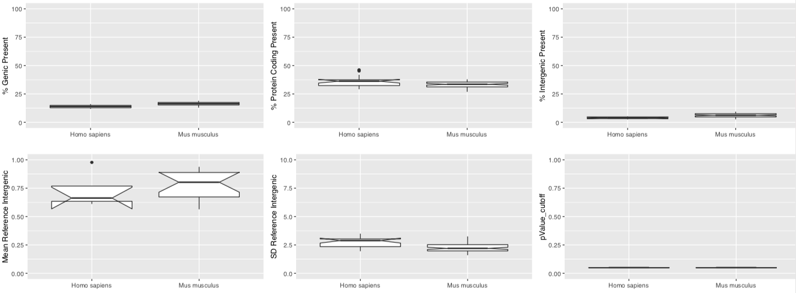

# Bgee: Single Cell RNA-Seq data analysis pipeline

**General information:**

1. [Introduction](#introduction)
2. [Step 1: Data annotation](#step-1-data-annotation)
3. [Step 2: Metadata and data download](#step-2-metadata-and-data-download)
   1. [Metadata](#metadata)
   2. [Data download](#data-download)

4. [Step 3: scRNA-Seq library analyses](#step-3-scrna-seq-library-analyses)
   1. [Data preparation](#data-preparation)
   2. [Pseudo-alignment](#pseudo-alignment)
   3. [Processing the files](#processing-the-files)
   4. [Loading the libraries for analysis](#loading-the-libraries-for-analysis)
   5. [Result processing at individual library](#result-processing-at-individual-library)
   6. [Post-processing: expression calls and rank computation](#post-processing-expression-calls-and-rank-computation)

**Detailed guidelines:**

1. [Preparation steps](#preparation-steps)
2. [Downloading](#downloading)
2. [Mapping and process the libraries](#mapping-and-process-the-libraries)
3. [Quality control and cell type identification](#quality-control-and-cell-type-identification)
4. [Presence calls](#presence-calls)

## General information:

### Introduction

scRNA-Seq data are used in Bgee to produce:

* baseline calls of presence of expression
* ranking of these baseline calls to identify the most important conditions with expression, for each gene
* calls of differential over-/under-expression

These results are then integrated in a consistent manner with all other results from other data types, to produce global calls of expression, and to compute gene expression ranks for calls of expression.

### Step 1: Data annotation

For scRNA-Seq we manualy annotated healthy WT data using information from GEO or from papers. The annotation of each library is done by using the scientific information provided by these sources.
All the data treated are present in the SRA, EBI ArrayExpress or Human Cell Atlas repositories.
The protocols selected at present for target based are only from `10X platform`.

### Step 2: Metadata and data download

#### Metadata

After the annotation process, where each library corresponds to multiple number of cells, we retrieve information if possible from the repository metadata in order to verify if the Bgee annotation and the repository are in concordance (also to complete information, as for example SRR Id's), if yes a file is written to proceed in the next steps of the pipeline `metadata_info_10X.txt`. If they are not, we save this information in `metadata_notMatch_10X.txt` and do not further use these libraries.

#### Data download

The download of the data is done only for the experiments that match the requirements in the previous steps.
These data are downloaded from three main sources:

- SRA: The data is downloaded using wget function in R. For each library three fastq files are downloaded, R1, R2 and I, respectively.

- EBI ArrayExpress: The data is downloaded using wget function in R. All downloaded files for each library are in BAM format. Then using the tool `bamTofastq` from 10X the files are converted to original FASTQ format files in order to make possible all analysis from the scratch.

- HCA: The data is downloaded using the HCA Command Line Interface (HCA-CLI) (https://data.humancellatlas.org/guides/consumer-vignettes/intro-to-downloading-and-analyzing#step-two-downloading-files-from-a-file-manifest-with-the-hca-cli). In order to do the download of the target libraries a manisfest file need to be downloaded first from the Human Cell Atlas data portal. This file is retrieved by experiment.
The downloaded of each library is done by retrieving directly the FASTQ file.

GTF annotation files and genome sequence fasta files are retrieved from Ensembl and Ensembl metazoa for all species included in Bgee (see `RNA-Seq pipeline`).
This information is used to identify sequences of genic regions, exonic regions, and intergenic regions, as described in the `RNA-Seq pipeline`. It is also used to generate indexed transcriptome files for all species in Bgee, using the `TopHat` and `Kallisto` software.

### Step 3: scRNA-Seq library analyses

For each independent library, we do:

#### Data preparation

* Check for presence 3 fastq.gz files: R1, I1 and R2 which contains the sequence of the cell barcode + UMI, the sample index, and the cDNA sequence, respectively.
* Estimation of read length, by using the mean of all reads of FASTQ file determined by `FASTP`.
* A FASTP file is generated for each FASTQ file to check for potential problems; it also provide information about possible trimmed samples.

#### Pseudo-alignment

The following parameters are used:

* K-mer length for indexing use the default K-mer size from Kallisto (31 K-mer).
* Pseudoalign the reads with `kallisto bus`.
* The technology argument referent to the single-cell technology is provided depending on the annotation information to the target library, this is passed to the argument as: 10xV2 or 10xV3.

#### Processing the files

The output files from Kallisto bus (matrix.ec, output.bus, run_info.json and transcripts.txt), are processed using the `bustools` software to go from the BUS file to a gene-UMI count matrix. The procedue is done following the bustools recommendation, this means:

* Correcting the barcodes that are within one hamming distance of the barcodes using the whitelist from 10X platform.
* Sort the busfile by organizing the file by: barcode, UMI, set, and multiplicity.
* Generate the UMI count matrix.

#### Loading the libraries for analysis

For each library the gene-UMI count matrix is loaded directly into R for analysis by initialy creating a sparseMatrix. Then the following steps are subsequently performed:

* Using `SEURAT` R package to perform quality control metrics as: filtering cells based on the knee plot.
* Target cell-types in each library by using information of the barcodes list provided by the authors to identify specific cells.

From this step 3 important files are exported in the end:

1) InformationAllLibraries.txt &rarr; contain information for each library regarding number of cells detected as well as the number of genes for each cell-type.
2) variabilityCluster.txt &rarr; contain information for each library about the number of clusters detected (UMAP) as well as the different cell-types detected per cluster.
3) markerGenes_Validated.txt &rarr; validation of marker genes proposed in the annotation file after data analysis.

#### Result processing at individual library

For each cell-type population in each individual library a table is exported containing all barcodes (cells per column) and the genomic features (gene Id per row) with correspondent UMI counts. Normalized values - Counts Per Million (CPM) are also computed from the raw UMI counts and exported per library/cell-type  population.

#### Post-processing: expression calls and rank computation

##### Expression calls

* Per cell population

To define the call of expression of a gene, we check whether its level of expression is over the background transcriptional noise. To estimate the background transcriptional noise, we use the level of expression of a set of reference intergenic regions.

In general the calls of genes at cell population level are done following the next steps:

1) For each library/cell population we sum the UMI counts of all cells,
2) Recalculate the normalized values (CPM) at cell population level,
3) Calculate mean and the standard deviation of the reference intergenic regions,
4) Compute the Z-Score for each gene ID,
5) Compute the p-value from the Z-Score for each gene ID.

Based on the pValue_threshold defined the genes are then classified as present or absent for the correspondent library/cell-type population.

* Per individual cell

To perform the calls for each gene ID at individual cell we do first a BH-FDR correction for a condition, this means:

1) For a condition we collect a vector of p-values (for a particular gene across *n* libraries) 
2) Then if in one of the libraries the p.adjusted value is lower or equal to the cut-off desired the gene is classified as present, in the referent condition, otherwise is absent. 

Then, at individual level, if the cell_*i* that belongs to the condition_*x* have at least 1 UMI the gene is classified as present, otherwise is absent.

##### Rank computation

Gene expression ranks allow to identify the most functionally-relevant conditions related to the expression of a gene. It is computed from integrating all data types used in Bgee. See [post_processing/](../post_processing/) for this pipeline step.

## Detailed guidelines (Developer):

### Preparation steps

The preparation step are divide in 2 main scripts that are available in the folder [0Preparation/](0Preparation/)

The [retrieve_metadata.R](#retrieve-metadata) is the first script to be run in the pipeline since this script will collect metadata information for each library annotated by Bgee. The information collected in the `metadata_info_10X.txt` file exported by the script allow us to know from which resource the files should be downloaded and which procedure should be applied (as for example, convert files format).

➡️ This script should be run in axiom server since we need internet connection to collect the information.

Another script that belongs to the preparation step is the [generateInfo.R](#generateInfo) that allow us to collect information of gene_id, gene_name, trasncript_id and biotype from the gtf_all file (generated by Bgee) for each species. Note that in the output files `gene_to_biotype_with_intergenic_SPECIES.tsv`, `gene_to_geneName_with_intergenic_SPECIES.tsv` and `transcript_to_gene_with_intergenic_SPECIES.tsv` they contain also intergenic information, that are important for downstream analysis (process busfile).

➡️ This script should be run in jura server since we need the gtf_all files from all species annotated.

In order to execute the initial part of the pipeline the following rules from the [Makefile](Makefile) should be executed:

`make get_annot` (Note: this is a html page not real .tsv files from annotation)

`make retrieve_metadata` (Note: this rule is executed using a sbatch script, specifically: `retrieve_metadata.sbatch`)

Before run the generateInfo file rule in the make, the download of the data should be done in axiom and just then we should move to jura, to execute the last part of the preparation step and then the next steps of the pipeline.

### Downloading

The scripts referents to download part are divided in 3 main scripts, where which one is referent to a different resource.

* [download_HCA.sbatch](#download-HCA-sbatch)
   * This batch script allow to retrieve the fastq.gz files for each library specified in the manifest file (source_files/scRNA_Seq)

* [download_reformat_EBI.R](#download-reformat-EBI-R)
   * This script allow to download the bam files for each library from EBI arrayExpress and then to convert this files to fastq.gz files using `bamtofastq` software from 10X.

   NOTE: exceptionally some libraries from EBI can be downloaded already in the fastq.gz format. If this happen is because, the bamtofastq does not recognized initially the bam format as being from 10X.

* [download_SRA.R](#download-sra-R)
   * This script allow to download data directly from SRA repository for each library. The files downloaded are fastq.gz format.

In the pipeline the download part is order by following rules:

`make download_HCA` (Note: this rule is executed using a sbatch script, specifically: `download_HCA.sbatch`)

`make download_EBI` (Note: this rule is executed using a sbatch script, specifically: `download_reformat_EBI.sbatch`)

`make download_SRA` (Note: this rule is executed using a sbatch script, specifically: `download_SRA.sbatch`)

NOTE: This can be done in parallel by executing `make -j3 list_new_downloads`

After the downloading part the rest of the pipeline is executed in jura server (sensitive server), by initially checking if all tools necessary are available `make check_tools`.

After that the generation of informative files for each species is done by executing the following rule:

`make generate_info` (Note: this rule is executed using a sbatch script, specifically: `generate_info.sbatch`)

### Mapping and process the libraries

#### Mapping

To run the mapping for each library the R script [Kallisto_bus.R](Kallisto-bus-r) from the folder [1Run/](1Run/) should be launched by using the following command `make kallisto_bus`.

For each library the kallisto BUS output file (output.bus) allow to store for each read the cell barcode, UMI information and the equivalence class resulting from the pseudoalignment. Also for each library is saved the equivalente class (matrix.ec), the transcript names for posterior analysis (transcript.txt) and a json file where contain the information about the pseudoalignment (run_info.json).

#### Processing

After the mapping in order to process the BUS output file we use the script [process_busFile.R](process-busFile-r) from the folder [1Run/](1Run/).

In this script we use `bustools` software to process each output.bus file from each library. The process of bustools starts, as specified before, by correcting the barcodes, sorting and then getting a generated UMI count matrix.

For each library the count of the UMIs are saved by making a transcript compatibility count (TCC) matrix and by making a gene count matrix, that will be used later for downstream analysis.

For each library the gene count matrix folder contain a matrix `.mtx` the genes names in the file `genes.txt` and the barcodes information in the file `barcode.txt`.

When this matrix is imported into R for data analysis we get the following information referent to each library:

* Barcode ID (cell per column) / gene ID (per row) with correspondent unique molecular identifier count.

Note that for each matrix from each library this contains multiple cell-types, that will be later on splitted by cell-type population.
To run this rule we type `make process_busFile`.

### Quality control and cell type identification

The next rule of the pipeline is done by `make qc_cellType` where is used the [QC_CelltypeIdentification.R](QC_CelltypeIdentification-r) script that is launched by the batch script [QC_CelltypeIdentification.sbatch](QC_CelltypeIdentification-sbatch).

In this part of the pipeline different steps are executed at individual library. For each matrix, the following steps are done:

1) Filtering cells based on the knee plot.
This standard single-cell RNA-seq quality control is used to determine a threshold for considering cells valid for analysis, as exemplified below for the library SRX3815587:

<table>
  <tr>
    <td></td>
  </tr>
 </table>

2) Identification of cell types based on barcodes provided in the annotation files.

3) UMAP plot with clustering numbers by SEURAT and then UMAP plot using the labels from the annotation (barcodes), as exemplified below for the library SRX3815587. The clustering is also used as quality control.

<table>
  <tr>
    <td></td>
    <td></td>
  </tr>
 </table>

Note: During this process a file `variabilityClusters.txt` is exported with variability information per cluster.

4) Export for each library information about the cell-types detected in the matrix, as well as, the number of cells and genes `InformationAllLibraries.txt`.

5) Export information about genes markers detected per library after data analysis and correspondent verification with genes markers provided by the authors, `markerGenes_Validated.txt`.

6) Export per library a file with UMI counts (raw counts) and a file with normalized counts (CPM) for each cell-type population detected.

### Presence calls

In this step of the pipeline to call present and absent genes we use the reference intergenic regions from the RNA-Seq pipeline. This comes from the fact that the density of deconvolute intergenic regions are tendency less noisy in RNA-Seq data compared with single cell, as specified in the single cell RNA-Seq full length protocols (README).

* Per cell population

In order to call present and absent genes by calculating the p-value of each gene ID we compute the mean and standard deviation of the reference intergenic regions (as described before). The script [Calls_cell_pop_per_library.R](Calls-cell-pop-per-library-R) should be executed by launch the correspondent batch script [Calls_cell_pop_per_library.sbatch](Calls-cell-pop-per-library-sbatch). This means, by executing in the sensitive server the rule `make calls`. This script export a main file regarding the detailed stats of each cell-type population in each library. A plot is also exported per species, as demonstrated below. 

* Per cell

As described before to classify a gene as present, the referent geneID need to be detected in a condition as present and have at least 1 UMI.

This means the individual calls at cell level are done after we use the method of Benjamini & Hochberg (1995) to control the false discovery rate in a condition.
