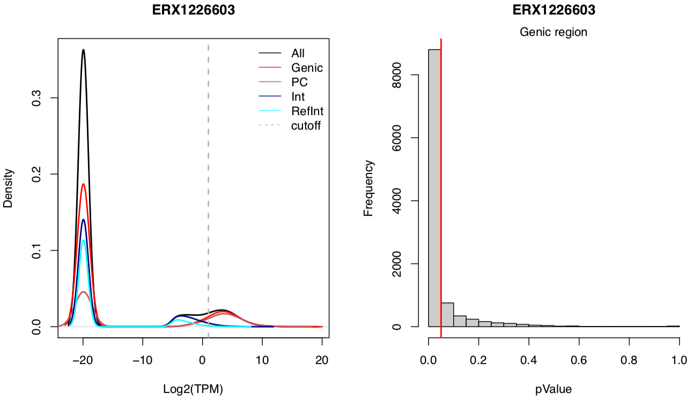

# Bgee: Single Cell RNA-Seq data analysis pipeline

**General information:**

1. [Introduction](#introduction)
2. [Step 1: Data annotation](#step-1-data-annotation)
3. [Step 2: Verification, data download and preparation of info file](#step-2-verification-data-download-and-preparation-of-info-file)
   1. [Verification: metadata from source and quantity of cells](#verification-metadata-from-source-and-quantity-of-cells)
   2. [Data download](#data-download)
   3. [Preparation of information file](#preparation-of-information-file)

4. [Step 3: scRNA-Seq library analyses](#step-3-scrna-seq-library-analyses)
   1. [Data preparation](#data-preparation)
   2. [Pseudo-alignment](#pseudo-alignment)
   3. [Result processing at individual cell](#result-processing-at-individual-cell)
   4. [Quality control for cell population](#quality-control-for-cell-population)
   5. [Post-processing: expression calls and rank computation](#post-processing-expression-calls-and-rank-computation)

**Detailed guidelines:**

1. [Preparation steps](#preparation-steps)
2. [Mapping the libraries](#mapping-the-libraries)
3. [Validate cell-type and experiment](#validate-cell-type-and-experiment)
4. [Presence calls](#presence-calls)

## General information:

### Introduction

scRNA-Seq data are used in Bgee to produce:

* baseline calls of presence of expression
* ranking of these baseline calls to identify the most important conditions with expression, for each gene
* calls of differential over-/under-expression

These results are then integrated in a consistent manner with all other results from other data types, to produce global calls of expression, and to compute gene expression ranks for calls of expression.

### Step 1: Data annotation

For scRNA-Seq we manualy annotated healthy WT data using information from GEO or from papers, or provided by WormBase. The annotation of each cell-type is done by using the scientific information provided by these sources.
All the data treated are present in the SRA repository.
The protocols selected at present are only full-length protocols, mainly `SMART-Seq`, `SMART-Seq2` and `SMARTer Ultra Low`.

### Step 2: Verification, data download and preparation of info file

#### Verification: metadata from source and quantity of cells

After the annotation process, where each library corresponds to an individual cell, we verify if the Bgee annotations are in concordance with repository metadata from where we download the data. If they are not, we save this information in `metadata_notMatch.txt` and do not further use these libraries.
In the next step we validate experiments based on a minimum quantity of cells (50) per cell-type in each experiment and species.

#### Data download

The download of the data is done only for the experiments that match the requirements in the previous steps.
These data are downloaded from SRA using the wget function in R. All files extracted are FASTQ files.

GTF annotation files and genome sequence fasta files are retrieved from Ensembl and Ensembl metazoa for all species included in Bgee (see `RNA-Seq pipeline`).
This information is used to identify sequences of genic regions, exonic regions, and intergenic regions, as described in the `RNA-Seq pipeline`. It is also used to generate indexed transcriptome files for all species in Bgee, using the `TopHat` and `Kallisto` software.

#### Preparation of information file

An information file is created by collecting information from the manual annotation and from the first quality control step using `FASTP` software for each FASTQ file, which correspond to each individual cell.

### Step 3: scRNA-Seq library analyses

For each independent library, we do:

#### Data preparation

* Check for presence of single-end FASTQ read file, or of the two FASTQ files for paired-end runs.
* Estimation of read length, by using the mean of all reads of FASTQ file determined by `FASTP`, in order to check which K-mer length should be applied.
* If the reads are less than 31 bp they are too short for Kallisto indexing with default k-mer length, and the k-mer length is set to 15 nucleotides.
* A FASTP file is generated for each FASTQ file to check for potential problems; it also provide information about possible trimmed samples.

#### Pseudo-alignment

The following parameters are used:

* No bootstrapping
* K-mer length for indexing: see `RNA-Seq pipeline`
* For single-end libraries, we provide as default fragment length 180 bp, with a sd of 20bp.
* For paired-end libraries, Kallisto can estimate the fragment length and sd, so we do not provide this information.

#### Result processing at individual cell

From the Kallisto output, for each genomic feature, counts of pseudo-aligned reads are retrieved.
The pseudo-aligned read counts, and the genomic feature effective lengths, are used to compute TPM values.
We sum at the gene level the counts of pseudo-aligned reads computed at the transcript level by Kallisto.
For calling genes present (see `Expression Calls`), we compute not only for genic regions, but also for intergenic regions.

#### Quality control for cell population

The quality control metric is done through cell population that belongs to the same cell-typeId, stageId, uberonId, strain and sex, as well as, to the same experiment and species.

Then we:

* compute the ratio of how many times a gene is detected across the number of cells with a simple threshold (TPM > 0).
* verify if the cell population follow a bimodal distribution, i.e. most genes are either present in almost all cells, or absent in almost all cells.

#### Post-processing: expression calls and rank computation

##### Expression calls

* Per individual cell

To define the call of expression of a gene in a library, we compute a Z-Score for each gene ID based from a set of reference intergenic regions. To see how the reference intergenic regions are defined look at it in the description section of the developer documentation of [RNA_Seq/](../RNA_Seq/) pipeline.

From the Z-Score values we compute a p-value for each geneID, this means a p-value distribution for the correspondent library. The p-values are used to call the genes as "present" or "absent" based on the p-value threshold specified. 

* Per cell population

To define the call of expression of a gene in a cell population for a given condition as "present" or "absent", we use the method of Benjamini & Hochberg (1995) to control the false discovery rate, as specified [here](https://stat.ethz.ch/R-manual/R-devel/library/stats/html/p.adjust.html).

This means, for a given condition we collect a vector of p-values (for a particular gene across *n* libraries) and then we classify the gene as present if in one of the libraries the p.adjusted value is lower or equal to the cut-off desired. 

##### Rank computation

Gene expression ranks allow to identify the most functionally-relevant conditions related to the expression of a gene. It is computed from integrating all data types used in Bgee. See [post_processing/](../post_processing/) for this pipeline step.

## Detailed guidelines (Developer):

### Preparation steps

The preparation step is done by executing 4 main R scripts available in the folder [0Preparation/](0Preparation/)

* [pre_process_control_annotation.R](#pre-process-control-annotation-R)
   * Remove experiments that not pass requirement of minimum number of cells.

* [retrieve_metadata.R](#retrive-metadata-R)
   * Retrieve metadata of the libraries that need to be downloaded.

* [download_cleaning_data.R](#download-cleaning-data-R)
   * Download all data annotated with minimum requirements.

This steps of the pipeline are done in the axiom server.

In order to execute the initial part of the pipeline the following rules from the [Makefile](Makefile) should be executed:

`make get_annot` (Note: this is a html page not real .tsv files from annotation)

`make control_annotation` (Note: this rule is runned in the axiom front)

`make retrieve_metadata` (Note: this rule is executed using a sbatch script, specifically: `retrieve_metadata.sbatch`)

`make download_cleaning_data` (Note: this rule is executed using a sbatch script, specifically: `download_cleaning_data.sbatch`)

The sbatch scripts allow to pass the arguments necessary to the R scripts in SLURM.

After this, 2 extra rules should be executed: one to list the new files downloaded and present at the time in sensitive server (JURA) `make list_new_downloads` and other one to commit the new modification on the files generated for single cell full-length protocols `make commit_annotation_and_metadata`.

Then the rest of the pipeline will be executed in the sensitive server.

Initially, we should check if all tools are available, by executing the rule `make check_tools`.

After that 3 informative files will be generated for each species. The files just contain information about genic types (gene2biotype, gene2transcript and gene2geneName). To execute this part of the pipeline the rule `generateInfo` should be executed.

* [generateInfo.R](#0Preparation/generateInfo.R)
   * Create three informative file about gene and correspondent biotype, gene and correspondent transcript as well as gene and correspondent gene name.

The last step of the preparation step, of the full-length protocols, is done by executing the rule `make prepare_singlecell_info` in the front-end of the sensitive server.

* [prepare_scrna_seq_sample_info.R](#prepare-scrna-seq-sample-info-R)
   * Create an info file about all libraries by collecting information from manual annotation and FASTP software

### Mapping and analysis of the libraries

To run the mapping for each library a R script from the folder [1Run/](1Run/) should be executed:

* [kallisto.R](#kallisto-R)
   * The script runs the pseudo-alignment for each individual library.

This script is launched by using a perl script `slurm_scheduler_Kallisto_scRNASeq.pl` that allow to launch multiple jobs at the same time in the sensitive server.

The second step is done by performing the analysis of each library, where the transcripts are summed to gene level and the TPM recalculated for genic regions without intergenic IDs.

Note that the scRNA-Seq pipeline is dependent of a folder that is generated in the RNA-Seq pipeline for each species:

   * transcriptome index (15 k-mer and 31 k-mer)

In order to execute the [analysis.R](#analysis-R) a sbatch script `analysis.sbatch` is used to launch the work in the sensitive server.
At this point, the rule `analysis` should be executed from the `Makefile`.

### Validate cell-type and experiment

In order to validate if an experiment should be integrated in Bgee, a validation criteria is applied by using a quality control script [1Run/QC_cellPopulation.R](1Run/QC_cellPopulation.R) launched in the server by using a sbatch script named `QC_cellPopulation.sbatch`.
The criteria is to verify if a cell population follow a bimodal distribution (as described before).
For this we quantify how many times the TPM value is higher then zero for each gene ID that belongs to biotype protein coding across *n* number of cells and then compute the correspondent ratio. After that a function from the R package `LaplacesDemon` is applied to determine if the ratio distribution is indeed bimodal.

### Presence calls

In this step of the pipeline to call present and absent genes we use a set of reference intergenic regions per species from the RNA-Seq pipeline. This comes from the fact that the density of deconvolute intergenic regions are tendency less noisy, as is showed in the graphics below, where the summed by species using just single cell data or by pulling all libraries together, this means RNA-Seq and scRNA-Seq, provide a more high overlap between intergenic and coding regions.

* Per cell

In order to call present and absent genes a set of expression of reference intergenic regions are used to calculate a theoretical p-value per gene ID, the script [1Run/scRNAseq_Calls_pValue.R](1Run/scRNAseq_Calls_pValue.R) should be executed by launch the correspondent sbatch script `scRNAseq_Calls_pValue.sbatch`. This means, by executing in the sensitive server the rule `make scRNAseq_Calls`.

Per individual library the densities distributions are exported as well as the p-value frequency plot. A report file containing the information about the library is also provided, example below.

After the calls of expressed genes for each individual cell, using a defined p-value threshold, we collect the global information about each library in the file `All_samples_stats_FL.tsv`. In order to summarize the information in a visual way a plot with the proportion of different types or biotypes, as protein coding, are exported as represented below (experiment ERP013381 from Mus musculus with 501 cells).

We should have in consideration, that because of high proportion of zeros in single cell RNA-Seq data, exist a proportional effect in the percentage of protein coding genes called present.

* Per cell-type population

As described before at the cell-type population level the calls are performed using the BH-FDR correction for a particular condition (done on the fly). 
